**React User List App**

This application will provide you users details. By default it will show all users, You can filter users by using search filters on the basis of firstname, lastname, uuid, phone, email and city. To view the user details, you can click on the user card and a modal will be displayed having all the user details.

**Project Structure **
- Inside main folder we have src folder
- Under common folder we have all the commonly used components and interfaces.
- Under core folder we have core helpers folder, services folder which includes our axios instance set  up and http methods used in our application.
- Under src folder we have pages folder
- Inside pages folder we have respective features folder (here we have the users folder). This folder includes feature wise api, components, store and container folders.
- Under src we have a rootStore folder which includes our common store used for state management.
- Under shared folder we have all the shared components

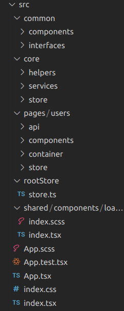

**State management**
- For state management we have used redux toolkit- 1.9.3

**Unit Test **
- For unit testing we have used jest

**Test cases code coverage**
- To generate code coverage we have used npx majestic

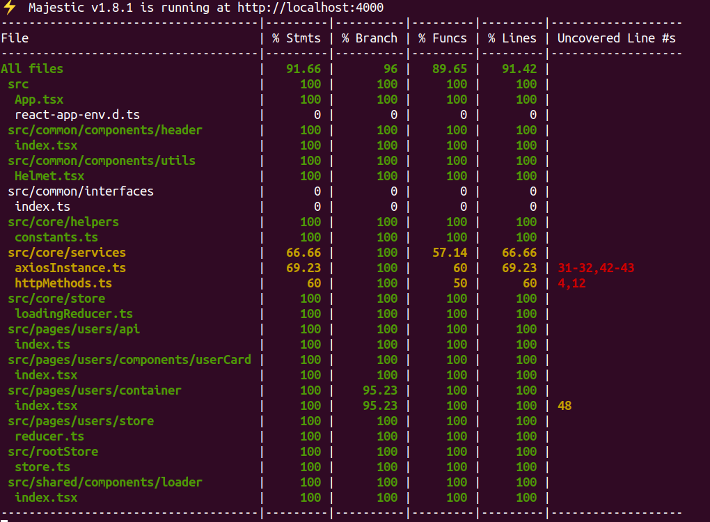

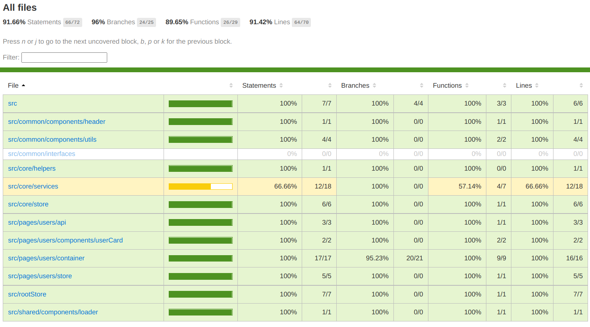

**Supported devices**
- Desktop
- Tablet
- Mobile

**App screens** 

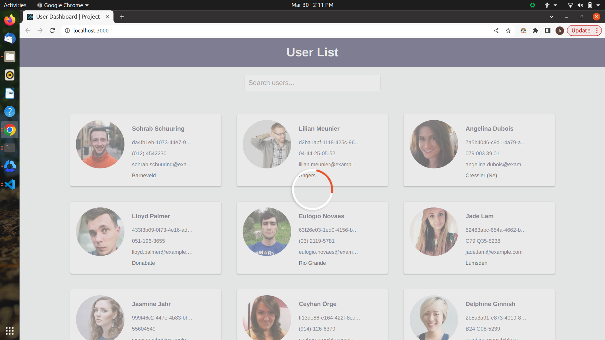

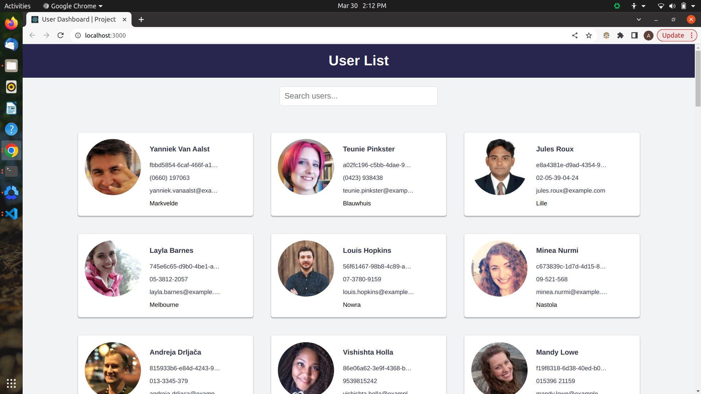

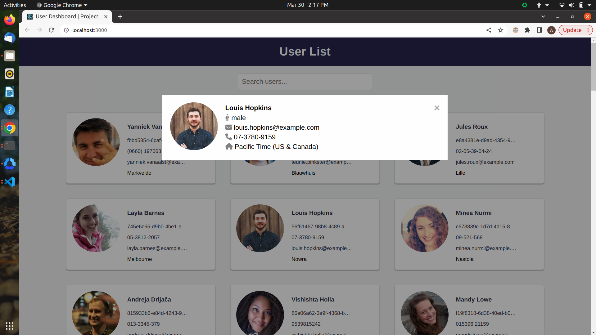

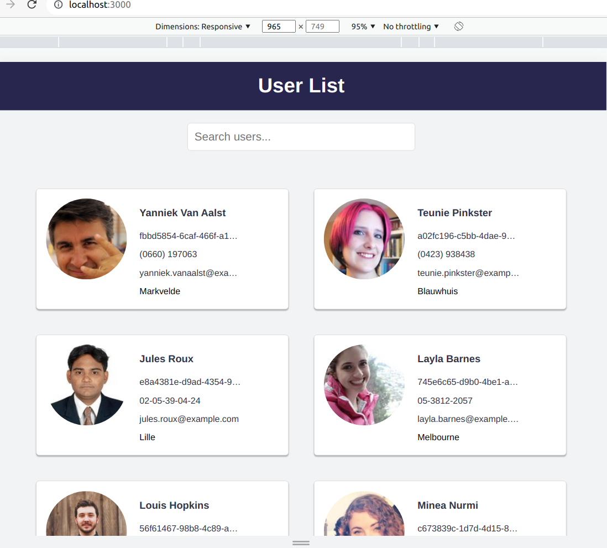

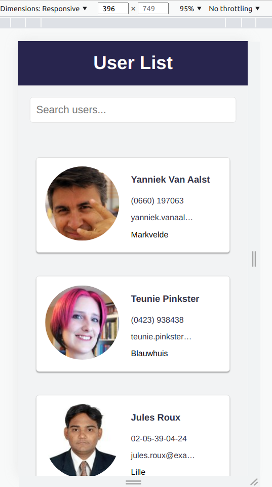

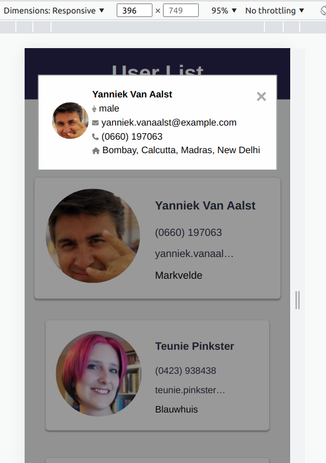

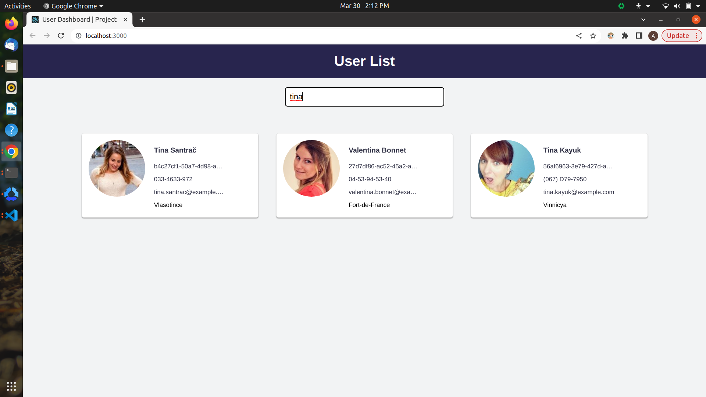

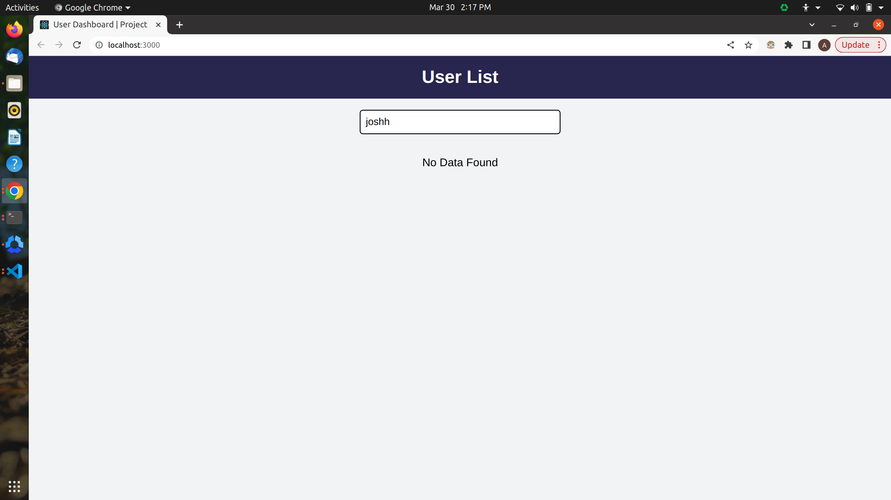


**Steps to run project **

## Project setup
```
yarn install
```
### Compiles and hot-reloads for development
```
yarn start
```
### Compiles and minifies for production
```
yarn build
```
### run test cases
```
yarn test
```
### generate code coverage with run  test cases
```
 npx majestic
```


